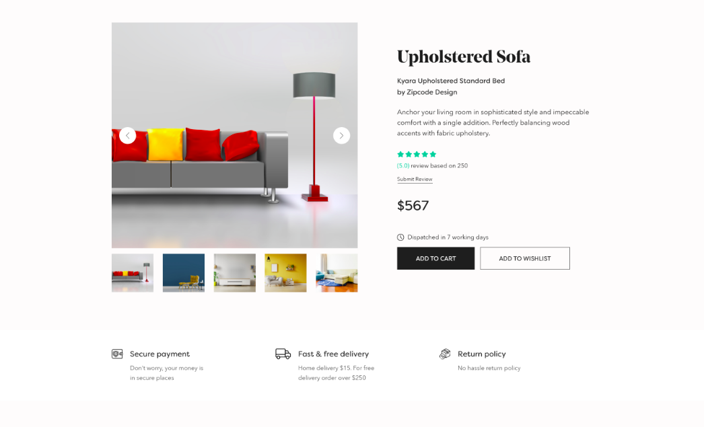
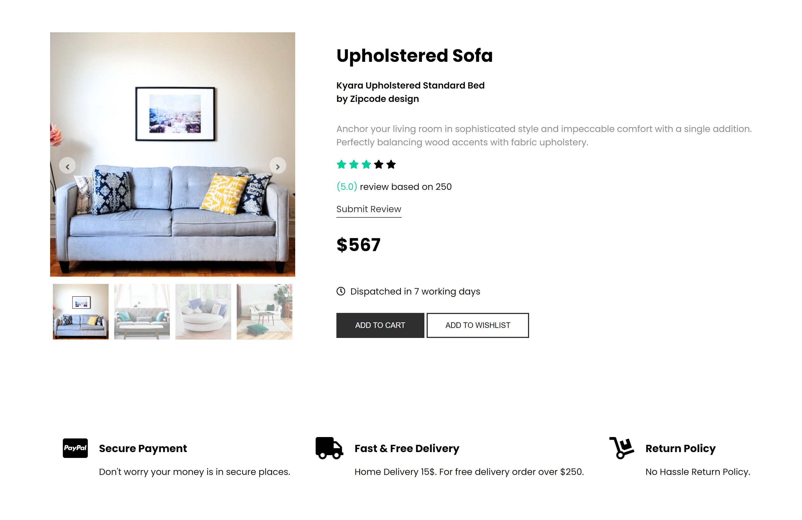
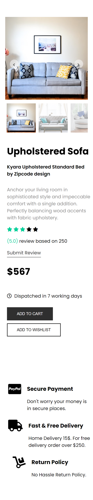

# skynox-internship-task

I have made this landing page for an assignment task given for an internship opportunity. I have used pure html, css, javascript. No third-party library is used. Font-awesome, google-font is used for icons and fonts in this project. I used fakeData to populate product details.

:round_pushpin: [LiveSite Link](https://www.google.com "Live")

### :point_down: Given jpg picture that need to turn into a (mobile-web) responsive functional landing page: 

### :point_down: Screenshot of my (web) responsive functional landing page:
 

### :point_down: Screenshot of my (mobile) responsive functional landing page:
 